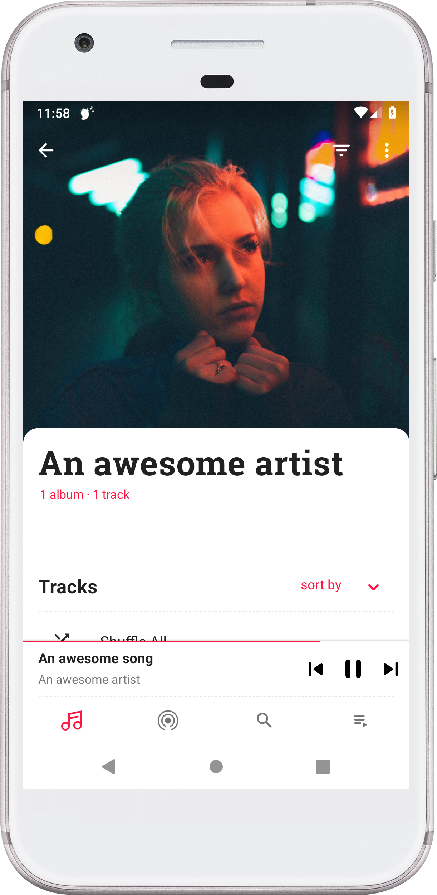
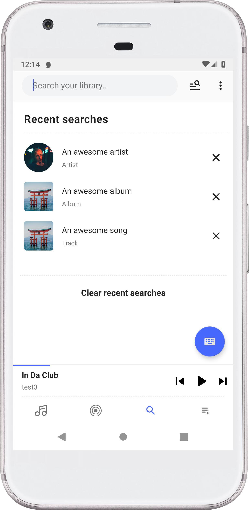
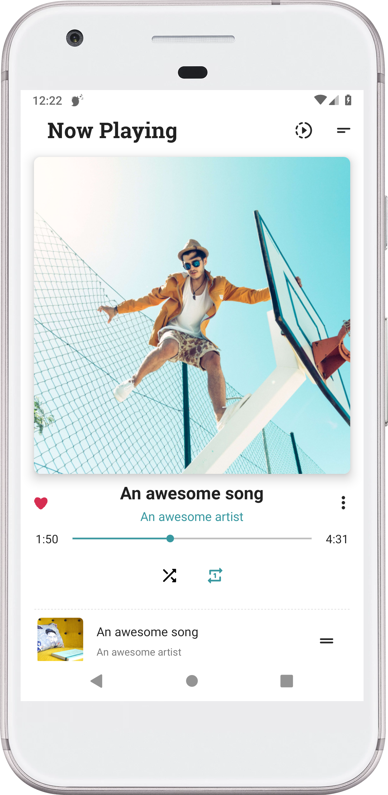

[github]:            https://github.com/ologe/canaree-music-player
[paypal-url]:        https://paypal.me/nextmusicplayer
[googleplay-url]:    https://play.google.com/store/apps/details?id=dev.olog.msc

[platform-badge]:   https://img.shields.io/badge/Platform-Android-F3745F.svg
[paypal-badge]:     https://img.shields.io/badge/Donate-Paypal-F3745F.svg
[googleplay-badge]: https://img.shields.io/badge/Google_Play-Demo-F3745F.svg
[minsdk-badge]:     https://img.shields.io/badge/minSdkVersion-21-F3745F.svg

<!------------------------------------------------------------------------------------------------------->


Canaree: Music Player
=

[![platform-badge]][github]
[![minsdk-badge]][github]
[![paypal-badge]][paypal-url]
[![googleplay-badge]][googleplay-url]

Complete music player published in the Play Store. Heavily relies on Dagger, ~~RxJava~~ kotlin coroutines and Clean architecture.

## Screenshots
<div style="dispaly:flex">
    
    
    
</div>


### Setup
The repository has [ExoPlayer](https://github.com/google/ExoPlayer) as git submodule, so you have clone the repository recursively:
```
git clone --recursive git@github.com:ologe/canaree-music-player.git
```
Or if you're already cloned the repository, use the following commands to fetch submodules:
```
git submodule init
git submodule update
```

Current exoplayer version used is `r2.10.4`
```
cd ExoPlayer
git checkout tags/r2.10.4
```

After that, you'll need to add the following properties to `local.properties`
```properties
last_fm_key=your_last_fm_key
last_fm_secret=your_last_fm_secret
```

### Extensions
To support [FLAC](https://github.com/google/ExoPlayer/tree/release-v2/extensions/flac), [FFMPEG](https://github.com/google/ExoPlayer/tree/release-v2/extensions/ffmpeg) and [OPUS](https://github.com/google/ExoPlayer/tree/release-v2/extensions/opus) formats to you need to compile manually the corresponding
ExoPlayer extensions.

`scripts` directory contains some scripts for building the extensions.

## Translations
Help translate the app to your language [here](https://canaree.oneskyapp.com/admin/project/dashboard/project/162621)

## Issues
If you find any problems, please feel free to file an [issue](https://github.com/ologe/canaree-music-player/issues).

## Open-source libraries
* [**ExoPlayer**](https://github.com/google/ExoPlayer)
* [**Dagger**](https://github.com/google/dagger)
* [**kotlinx.coroutines**](https://github.com/Kotlin/kotlinx.coroutines)
* [**Scroll helper**](https://github.com/ologe/scroll-helper)
* [**Color desaturation**](https://github.com/ologe/color-desaturation)
* [**Content resolver SQL**](https://github.com/ologe/android-content-resolver-SQL)
* [**Glide**](https://github.com/bumptech/glide)
* [**Lottie**](https://github.com/airbnb/lottie-android)
* [**Retrofit**](https://github.com/square/retrofit)
* [**OkHttp**](https://github.com/square/okhttp)
* [**Gson**](https://github.com/google/gson)
* [**LastFm bindings**](https://github.com/jkovacs/lastfm-java)
* [**java-aes-crypto**](https://github.com/tozny/java-aes-crypto)
* [**Custom tabs**](https://github.com/saschpe/android-customtabs)
* [**Material dialogs**](https://github.com/afollestad/material-dialogs)
* [**fuzzywuzzy**](https://github.com/xdrop/fuzzywuzzy)
* [**Leak canary**](https://github.com/square/leakcanary)

## Download
[](https://play.google.com/store/apps/details?id=dev.olog.msc)